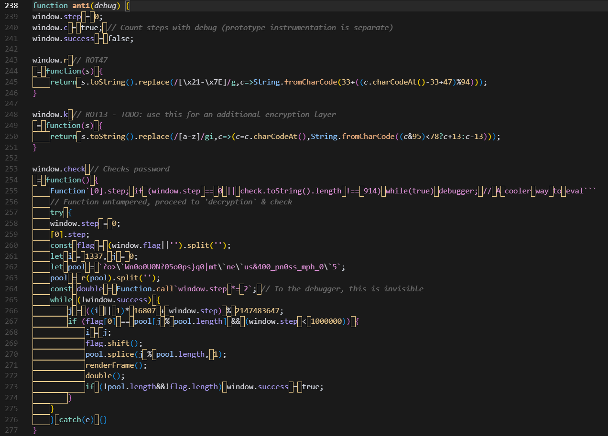

# Google CTF 2025 Java Safe 6.0 WP 
### 题目简单分析
题目为两段JS代码
前一段展示了一个动态图案在前端
后一段为一个验证逻辑，如果输入正确的flag即可解密加密的内容
加密的内容不需要在乎
题目的目标是获取正确的flag

### 思路
题目的核心代码在 `anti()` 内
`anti()` 内前面注册了几个变量和函数到 `windows` 对象中
这一段非常凶险，有一些不可见字符:

这一段代码由于不可见字符,`rot13` 功能的代码实际是执行了的

`anti()` 中这个函数进行了插桩和反调试
前面的 debug 功能是监控了JavaScript的核心内置对象，统计调用函数时使用的函数名长度，这个地方会影响 `window.step`
后面的 debug 会检测代码的总长，是反调试点，可以直接改成 `debug(f, "false");`
这个函数对下面的方法调用都会进行监控：
```
Array：数组构造函数和所有数组方法（push, pop, splice等）
String.prototype：所有字符串方法（replace, split, charAt等）
Math：数学函数（random, floor, ceil等）
console：控制台方法（log, clear, debug等）
Reflect：反射API（get, set, apply等）
额外添加：check（密码验证）和eval（代码执行）
```
```java
//插桩实现的功能
function instrument() {
    f = arguments[0];
    // TODO: figure out how to get a runtime reference to the debugged function in this debug
    // condition context, so we can inspect it at runtime, in case it changes
    debug(f, "window.c && function perf(){ const l = `" + f + "`.length; window.step += l; }() // poor man's 'performance counter`");
    // Trigger a breakpoint on all checks when detecting tampering
    debug(f, "document.documentElement.outerHTML.length !== 14347");
}
...
//插桩的对象
[Array, Array.prototype, String.prototype, Math, console, Reflect].map(o =>
    Object.values(Object.getOwnPropertyDescriptors(o)).map(x => x.value || x.get).filter(x => x instanceof Function) 
).flat().concat(check, eval).forEach(instrument);
```

下面的这段代码监控了 `Array.prototype` 的所有属性访问和反射操作
Array.prototype是一个特殊的对象，它包含了所有数组都可以使用的方法和属性
有这两种操作都会使 `window.step` 改变

```java
function instrumentPrototype(o) {
    Object.entries(Object.getOwnPropertyDescriptors(o))
      .filter(p => p[1].value instanceof Function)
      .forEach(p => Object.defineProperty(o, p[0], {
        get: () => (step++) && p[1].value
      }));
}

function instrumentPrototypeOfPrototype(o) {
    const handler = {};
    Reflect.ownKeys(Reflect).forEach(h => handler[h] = (a,b,c) => (step++) && Reflect[h](a, b, c));
    Object.setPrototypeOf(o, new Proxy(Object.getPrototypeOf(o), handler));
}
...
instrumentPrototype(Array.prototype);
instrumentPrototypeOfPrototype(Array.prototype);
```

值得注意的是，插桩的时候有这样的三行代码顺序
```java
[Array, Array.prototype, String.prototype, Math, console, Reflect].map(o =>
    Object.values(Object.getOwnPropertyDescriptors(o)).map(x => x.value || x.get).filter(x => x instanceof Function) 
).flat().concat(eval).forEach(instrument);
instrumentPrototype(Array.prototype);
instrumentPrototypeOfPrototype(Array.prototype);
```
在执行第一行代码之后，使用 `debug` 对 `Array, Array.prototype, String.prototype, Math, console, Reflect` 这几个对象进行插桩，这对其进行了一定的保护，确保了调用这几个对象的方法可以正常返回方法的引用

这样在执行第二行代码时，其返回引用错误的问题就会得到修复
这行代码`get: () => (step++) && p[1].value`正确应该写为`get: () => (++step) && p[1].value`

这样第三行代码就不会报 `forEach` 方法不存在的错误

可以通过下面的这段代码验证上面的问题：
可以发现方法被改成了 number 而不是原来的 function

```html
<!DOCTYPE html>
<html lang="en">

<head>
<meta charset="UTF-8">
<meta name="viewport" content="width=device-width, initial-scale=1.0">
<meta http-equiv="Content-Security-Policy" id="c" content="script-src 'self' 'sha256-HFum26eAoDvh1Va9Zg6EMtw4z91mrmX2KhzBTA34JLQ=' 'unsafe-eval'">

</head>

<body>
<pre id="cubeCanvas"></pre>

<script id="gemini's cube">
function anti(debug) {
step = 0;

function instrument() {
    f = arguments[0];
    // TODO: figure out how to get a runtime reference to the debugged function in this debug
    // condition context, so we can inspect it at runtime, in case it changes
    debug(f, "window.c && function perf(){ const l = `" + f + "`.length; window.step += l; }() // poor man's 'performance counter`");
}
function instrumentPrototype(o) {
    Object.entries(Object.getOwnPropertyDescriptors(o))
      .filter(p => p[1].value instanceof Function)
      .forEach(p => Object.defineProperty(o, p[0], {
        get: () => (step++) && p[1].value
      }));
}

function instrumentPrototypeOfPrototype(o) {
    const handler = {};

    const arr = Reflect.ownKeys(Reflect);
    console.log('"forEach" in arr:', 'forEach' in arr); // true（存在）
    console.log('typeof arr.forEach:', typeof arr.forEach); // 可能是 undefined/function

    Reflect.ownKeys(Reflect).forEach(h => handler[h] = (a,b,c) => (step++) && Reflect[h](a, b, c));
    Object.setPrototypeOf(o, new Proxy(Object.getPrototypeOf(o), handler));
}

console.log("Array.prototype.forEach 类型:", typeof Array.prototype.forEach);

// [Array, Array.prototype, String.prototype, Math, console, Reflect].map(o =>
//     Object.values(Object.getOwnPropertyDescriptors(o)).map(x => x.value || x.get).filter(x => x instanceof Function) 
// ).flat().concat(eval).forEach(instrument);

instrumentPrototype(Array.prototype);

console.log("Array.prototype.forEach 类型:", typeof Array.prototype.forEach);

instrumentPrototypeOfPrototype(Array.prototype);

}
</script>

</body>
</html>
```

你在验证我给出的代码时会遇到类似这样的错误
```
check_csp.html:14 Refused to execute inline script because it violates the following Content Security Policy directive: "script-src 'self' 'sha256-3i8iW/rI619vFLSOcIVx6lQ6gE8pFVpeQMLriw/zs/E=' 'unsafe-eval'". Either the 'unsafe-inline' keyword, a hash ('sha256-HFum26eAoDvh1Va9Zg6EMtw4z91mrmX2KhzBTA34JLQ='), or a nonce ('nonce-...') is required to enable inline execution.
```
这是浏览器的一个 CSP 防护机制
你把他给你计算的 sha256 覆盖这个标签 `<meta http-equiv="Content-Security-Policy" id="c" content="script-src 'self' 'sha256-HFum26eAoDvh1Va9Zg6EMtw4z91mrmX2KhzBTA34JLQ=' 'unsafe-eval'">`中的sha256就不会报错了（题目中有两段 script 可以将第二段的粘贴到第一段，看报错来计算 sha256）
这也是这个题目的一个坑点，这个 CSP 防护也会确保方法返回正确的引用，在你取消上面测试代码的注释内容后，如果你删除标签，你会发现，这个方法又被改成了 number 而不是原来的 function

这时候可能会问：那我把开头的标签删除了，后面的插桩再改成 `++step` 是不是就可以了？额，比赛的时候就是卡在这里了，

也不行！这个这样修改还是会使 `forEach` 方法在某一段时间变成 `number` 会影响 `step` 的变化

所以我们应该使用改动最小的方法，来记录输出 `check` 函数中，`pool` 的取值

### 最终解法
参考群内大佬：
```html
<!DOCTYPE html>
<html lang="en">

<head>
<meta charset="UTF-8">
<meta name="viewport" content="width=device-width, initial-scale=1.0">
<meta http-equiv="Content-Security-Policy" id="c" content="script-src 'sha256-P8konjutLDFcT0reFzasbgQ2OTEocAZB3vWTUbDiSjM=' 'sha256-fs7unN9qLfSWTP7ZjAeBwHscDs8gyRR2V19SQWQ0WPI=' 'unsafe-eval'">
<title>ASCII Rotating Cube</title>
<style>
/* Basic styling to center the animation and give it a retro feel */
body {
    display: flex;
    justify-content: center;
    align-items: center;
    min-height: 100vh;
    margin: 0;
    background-color: #1a1a1a;
    /* Dark background */
    font-family: monospace, "Courier New", Courier;
    /* Monospace font for ASCII art */
    color: #00ff00;
    /* Green text, classic terminal style */
}

pre {
    line-height: 1.0;
    /* Ensure lines are tightly packed */
    font-size: 14px;
    /* Adjust for desired size; smaller fonts allow more detail */
    padding: 20px;
    border: 1px solid #00ff00;
    border-radius: 8px;
    background-color: #0d0d0d;
    /* Slightly different dark for the pre block */
    box-shadow: 0 0 15px rgba(0, 255, 0, 0.3);
}
</style>
</head>

<body>
<pre id="cubeCanvas"></pre>

<script id="gemini's cube">
// --- Configuration ---
const canvas = document.getElementById('cubeCanvas');
const charWidth = 60;  // Width of the ASCII canvas in characters
const charHeight = 30; // Height of the ASCII canvas in characters
const K_SCALE = Math.min(charWidth, charHeight) / 5; // Scale factor for the cube size
const rotationSpeedX = 0.02;
const rotationSpeedY = 0.015;
const frameInterval = 200;
const edgeChar = '#'; // Character used to draw edges
const vertexChar = '*'; // Character used to draw vertices (optional)
const drawVertices = false; // Set to true to draw vertices

// --- Cube Definition ---
// Vertices of a unit cube centered at (0,0,0)
const vertices = [
    { x: -1, y: -1, z: -1 }, { x: 1, y: -1, z: -1 }, { x: 1, y: 1, z: -1 }, { x: -1, y: 1, z: -1 },
    { x: -1, y: -1, z: 1 }, { x: 1, y: -1, z: 1 }, { x: 1, y: 1, z: 1 }, { x: -1, y: 1, z: 1 }
];

// Edges defined by pairs of vertex indices
const edges = [
    [0, 1], [1, 2], [2, 3], [3, 0], // Back face
    [4, 5], [5, 6], [6, 7], [7, 4], // Front face
    [0, 4], [1, 5], [2, 6], [3, 7]  // Connecting edges
];

let currentAngleX = 0;
let currentAngleY = 0;
let lastFrameTimestamp = 0;
let frameTime = 0;

// --- 3D Rotation Logic ---
function rotatePoint(point, angleX, angleY) {
    const { x: x_orig, y: y_orig, z: z_orig } = point;

    // Rotate around X-axis
    const cosX = Math.cos(angleX);
    const sinX = Math.sin(angleX);
    const y_after_X = y_orig * cosX - z_orig * sinX;
    const z_after_X = y_orig * sinX + z_orig * cosX;
    const x_after_X = x_orig;

    // Rotate around Y-axis (using results from X-rotation)
    const cosY = Math.cos(angleY);
    const sinY = Math.sin(angleY);
    const x_final = x_after_X * cosY + z_after_X * sinY;
    const z_final = -x_after_X * sinY + z_after_X * cosY;
    const y_final = y_after_X;

    return { x: x_final, y: y_final, z: z_final };
}

// --- 2D Projection Logic (Orthographic) ---
function projectPoint(point) {
    // Scale and translate to fit the ASCII grid
    const x2d = Math.round(point.x * K_SCALE + charWidth / 2);
    const y2d = Math.round(point.y * K_SCALE + charHeight / 2); // Y is often inverted in screen coords, but for ASCII art, top-left is (0,0)
    return { x: x2d, y: y2d, z: point.z }; // Keep z for potential depth sorting if needed
}

// --- ASCII Line Drawing (Bresenham's Algorithm) ---
function drawLineOnGrid(grid, x1, y1, x2, y2, char) {
    // Ensure coordinates are integers
    x1 = Math.round(x1); y1 = Math.round(y1);
    x2 = Math.round(x2); y2 = Math.round(y2);

    const dx = Math.abs(x2 - x1);
    const dy = Math.abs(y2 - y1);
    const sx = (x1 < x2) ? 1 : -1;
    const sy = (y1 < y2) ? 1 : -1;
    let err = dx - dy;

    while (true) {
        // Check bounds before drawing
        if (x1 >= 0 && x1 < charWidth && y1 >= 0 && y1 < charHeight) {
            grid[y1][x1] = char;
        }
        if ((x1 === x2) && (y1 === y2)) break; // Reached the end point
        const e2 = 2 * err;
        if (e2 > -dy) { err -= dy; x1 += sx; }
        if (e2 < dx) { err += dx; y1 += sy; }
    }
}

// --- Helper Functions ---
// Replace the spaces from the start of each line
function f(s) {
    return s.replace(/^[ ]*/mg, '');
}

// Remove emtpy lines from the start and the end
function r(s) {
    return s.replace(/^\n/, '').replace(/\n$/, '')
}

// Tagged template function to help define multiline strings
function multiline(x) {
    return f(r(x[0]));
}

// --- Main Render Loop ---
function renderFrame() {
    const background = multiline`
        h^Y8]nM7s0HgX@mN.xb.4g~e*sh=Z'8*4UGpmMr]$.ljH{Q4&6r-Zew9!zzH
        7im:7zzs+t &5L'5wv&|ssS8R7g5Sb!f42Q@xN{B{$$s{FQNMK/wD(3xLnXO
        XLG-uI#'eOTS,]QrwB4DLLt+CaUEM_)Lnoe&LZ~*A#][!_8gDd~^fPubXbb^
        0%4s*+7']ER:az7qR6D0$A2plQs@}{z:z 3Q,+jbUS9sT8'>m-uasBb$o5{6
        555fF[?zR]}ie+bcZ5Nk<3Zpmj7r$^X.E&6C:vT;c!ES@>}*)bfup:O>U#j@
        ^7,]}oTU}[=Ln6"Y^jH:?5@H]4UU4]@FE6Cw%|{UU1Q!t5=}<^Y?ii,7('-$
        ZH%aT=ws"kgLF$Th9[1UU4]@FE6Cw%|{]=6?8E9Yall^Y:~mR9%OQ,w7BMdY
        b}|/%67!xz&|I~N2hY^bgeUUWW?6H tCC@CX^Y@"/>{iB^,/cG8Tnq;]96wT
        g%l$!0Psg2S'dn%Y^]DE24<]DA=:EWV6G2=VX]=6?8E9mcXUU19V{&>m*;>o
        ~Meepb"9ft"*E.D2D51UUWH:?5@H]DE6AZlhd^YO%5NBgb=<V.s+m(x=:.5[
        >CGqx0AvnhC"jMN@AY^Za_Y|2E9]7=@@CW1YVw"Xn!"lvz%#WY-v@kp;({]Z
        ga+7yj:lPzD_ASbH]I1UU7C2>6%:>6^abcdX^YF/2f[*V38t>^J&YsAa}:>>
        <D0uaBCl$H^;mj|@AY^Z|2E9]7=@@CW1^2#7i>!X:ZeR&/KZGA7%*"^!q0/]
        _@~]fU@'RMyt*Z}H]I1UUH:?5@H]DE6A^a_XXj18'hf*;~"EO9Fxo+Y(d4l4
        eX,w_]lom0eNJeU1j>F=E:=:?6]2C8F>6?ED,_.,_.^Y$0=]e+Qd+"|# Gy*
        Z05Jj[jAvzKMe(Y=jA[2Y^]C6A=246W^/-?M-?S^8[^Y=4vN-U_xU66h7IG<
        : |bVI:aw4HN@o-Y^VVX]C6A=246W^/, .Y^>8[VVXMM1:,)x'6p:0 @U^E3
        :h5dQ%Wdj8TkvrsncdiKf H?_L5oYT_&G;SZod(CN@mviH?s=%ACI,(78Z<q
        >&5XOy'ffjhS{c&EU!,&~OYd;umr(Ya@2=PcP+Q@;vS0n&eKm0L;$c&wGYQx
        IH;ZT/fm{C_A_:;bo B7tk0.R~AU6}n<U%R[,VTsyOL_-On!M%A].7vhbiz:
        lGl"LJ%M~.Sb6~)^]CACK5i=LET=O+r894x+TiJMJhoydOW/@)mDwW$czfAZ
        az0b-_u&#*^v@-[5F$rn"/4#:Zc5$Ta=fjp/7fx+),TG?P9n6LJiTB',j.2I
        NU c6GH(ekyxHV,JkwvCfhVPcnE8;(C=2}_?gwszoo^QD[S?3Zn;p4k,YFXx
        {RNy(zq]".#>]C<|+4Mn(}!/+YACj}R}XYKuc|9tLM}hseQN''6H?X-oS*#R
        eHG26u.HCZX!9!w8%St-LYmbhf2rl{"}:*J&~yZ6ALpI5c$P?iUku/Fw!GX,
        h:r~FHyCgj'G4Y<{f~:ION'^nggp,LI7t8i]{UD,DlVz/2?S"N"O64rIO#Jk
        3~iv^VZYD@ltQT<*h]'l7kMk!lWpT3jMDq!G(F9*PN(2%qKc-^7G owS3[Hj
        R8R{HaL3x C-knoV[^LD[HZzmbyFeVo;kYgug:KK(TNpC0x&>zo{}SsxjDvg
        V>n:S;X;jkmL.C2+tf;P6,XeLoM"W7on7yw2~5Y;m_OI%>>!BqCuUgQT"ieb
        vdRWZ@dK/9U[E4zKqz0_WnwTtBR$T&BavJ}~)Kq=J{-A7+ni6dzgu:)jfI4v

        Welcome to your personal JS Safe!

        Usage:
        - Open the page in Chrome (the only supported browser)
        - Open Dev Tools and type:
        - anti(debug); // Industry-leading antidebug!
        - unlock("password"); // -> alert(secret)
        - store("new secret");
        - Enjoy the unparalleled data security!!!!1
    `;
    let grid = background.split('\n').map(l => l.split(''));

    // Clear the middle part to make the cube clearly visible
    for (let i = 5; i < 25; i++) {
        for (let j = 15; j < 45; j++) {
            grid[i][j] = ' ';
        }
    }

    // Rotate and project all vertices
    const rotatedVertices = vertices.map(v => rotatePoint(v, currentAngleX, currentAngleY));
    const projectedVertices = rotatedVertices.map(v => projectPoint(v));

    // Draw vertices (optional)
    if (drawVertices) {
        projectedVertices.forEach(p => {
            if (p.x >= 0 && p.x < charWidth && p.y >= 0 && p.y < charHeight) {
                grid[p.y][p.x] = vertexChar;
            }
        });
    }

    // Draw edges
    edges.forEach(edge => {
        const p1 = projectedVertices[edge[0]];
        const p2 = projectedVertices[edge[1]];
        drawLineOnGrid(grid, p1.x, p1.y, p2.x, p2.y, edgeChar);
    });

    // Convert grid to string and update the canvas
    const content = grid.map(row => row.join('')).join('\n');
    canvas.textContent = content;
    console.clear();
    console.log(content);

    // Update angles for the next frame
    currentAngleX += rotationSpeedX;
    currentAngleY += rotationSpeedY;
    
    // Save timestamp and frame time for statistics
    frameTime = (new Date()) - lastFrameTimestamp;
    lastFrameTimestamp = +(new Date());
}

// --- Start Animation ---
setInterval(renderFrame, frameInterval);
renderFrame(); // Initial render
</script>

<script>
function anti(debug) {
window.ansflag = '';
window.step = 0;
window.cﾠ= true; // Countﾠstepsﾠwith debug (prototype instrumentation is separate)
window.success = false;

window.r // ROT47
 = function(s) {
    return s.toString().replace(/[\x21-\x7E]/g,c=>String.fromCharCode(33+((c.charCodeAt()-33+47)%94)));
}

window.k // ROT13 - TODO:ﾠuse thisﾠfor anﾠadditional encryption layer
ﾠ= function(s) {
    return s.toString().replace(/[a-z]/gi,c=>(c=c.charCodeAt(),String.fromCharCode((c&95)<78?c+13:c-13)));
}

window.check // Checks password
 = function() {
    Function`[0].step; if (window.step == 0 || check.toString().length !== 914) while(false) debugger; // Aﾠcooler wayﾠto eval```
    // Functionﾠuntampered,ﾠproceed to 'decryption` & check
    try {
    window.step = 0;
    [0].step;
    const flag = (window.flag||'').split('');
    let iﾠ= 1337, j = 0;
    let pool =ﾠ`?o>\`Wn0o0U0N?05o0ps}q0|mt\`ne\`us&400_pn0ss_mph_0\`5`;
    pool = r(pool).split('');
    const double = Function.call`window.stepﾠ*=ﾠ2`;ﾠ// To the debugger,ﾠthis isﾠinvisible
    while (!window.success) {
        j = ((iﾠ|| 1)* 16807 + window.step) % 2147483647;
let x = pool[j % pool.length];
window.ansflag += x;
        if ((flag[0] == x && (window.step < 1000000)) || true) {
            iﾠ= j;
            flag.shift();
            pool.splice(j % pool.length, 1);
            renderFrame();
            double();
            if (!pool.length&&!flag.length) window.success = true;
        }
    }
    } catch(e) {}
}

function instrument() {
    f = arguments[0];
    // TODO: figure out how to get a runtime reference to the debugged function in this debug
    // condition context, so we can inspect it at runtime, in case it changes
    debug(f, "window.c && function perf(){ const l = `" + f + "`.length; window.step += l; }() // poor man's 'performance counter`");
    // Trigger a breakpoint on all checks when detecting tampering
    debug(f, "false");
}

function instrumentPrototype(o) {
    Object.entries(Object.getOwnPropertyDescriptors(o))
      .filter(p => p[1].value instanceof Function)
      .forEach(p => Object.defineProperty(o, p[0], {
        get: () => (step++) && p[1].value
      }));
}

function instrumentPrototypeOfPrototype(o) {
    const handler = {};
    Reflect.ownKeys(Reflect).forEach(h => handler[h] = (a,b,c) => (step++) && Reflect[h](a, b, c));
    Object.setPrototypeOf(o, new Proxy(Object.getPrototypeOf(o), handler));
}

[Array, Array.prototype, String.prototype, Math, console, Reflect].map(o =>
    Object.values(Object.getOwnPropertyDescriptors(o)).map(x => x.value || x.get).filter(x => x instanceof Function) 
).flat().concat(check, eval).forEach(instrument);
instrumentPrototype(Array.prototype);
instrumentPrototypeOfPrototype(Array.prototype);
}

function unlock(flag) {
  const match = /^CTF{([0-9a-zA-Z_@!?-]+)}$/.exec(flag);
  if (!match) return false;
  window.flag = match[1];
  check();
  if (!window.success) return;
  window.password = Array.from(window.flag).map(c => c.charCodeAt());
  const encrypted = JSON.parse(localStorage.content || '[]');
  const decrypted = encrypted.map((c,i) => c ^ password[i % password.length]).map(String.fromCharCode).join('');
  alert("JS Safe opened! Content:" + decrypted);
}

function store(secret) {
  const plaintext = Array.from(secret).map(c => c.charCodeAt());
  localStorage.content = JSON.stringify(plaintext.map((c,i) => c ^ password[i % password.length]));
}
</script>

</body>
</html>
```
加一个 `window.ansflag` 记录 `pool` 解码后的值，或上 `true` 就可以了 :`        if ((flag[0] == x && (window.step < 1000000)) || true) {`
建议自己手动改，因为源码中有不可见字符
控制台输入(49个a是因为pool的长度也是49)：
```
ant(debug)
unlock('CTF{aaaaaaaaaaaaaaaaaaaaaaaaaaaaaaaaaaaaaaaaaaaaaaaaa}')
window.ansflag
```
捏🐎，可恶的 JavaScript ，薛定谔的变量，最后那个 forEach 受到哪些因素影响还是没有搞很清楚，变来变去的
